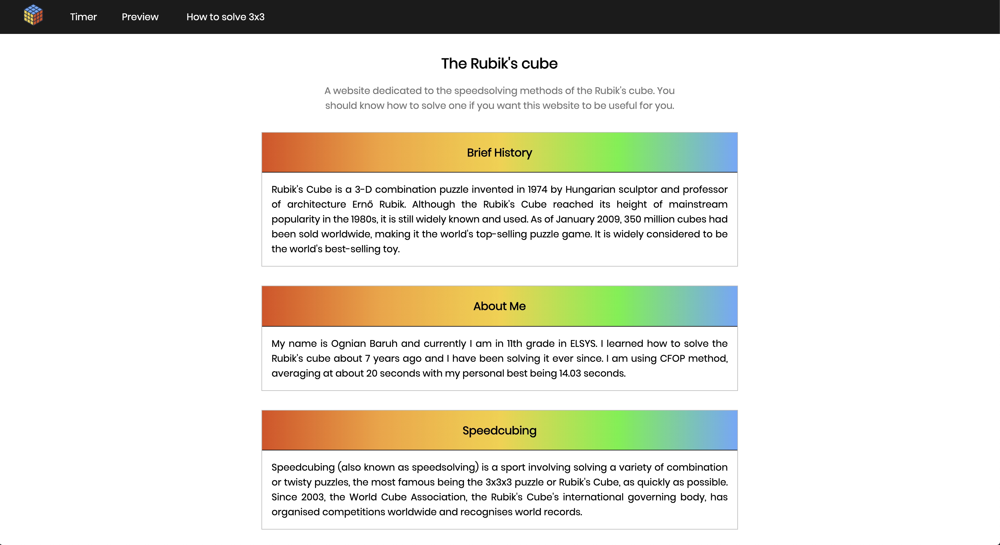
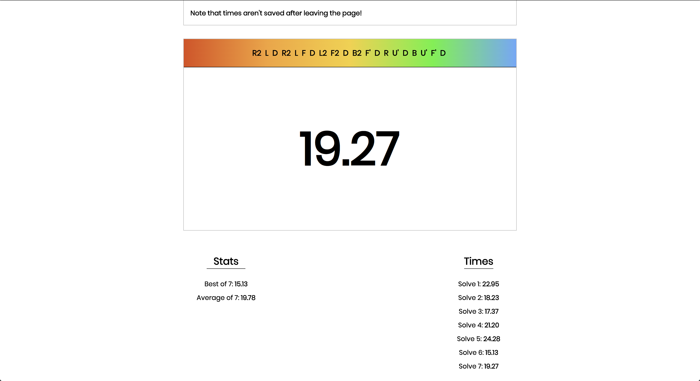
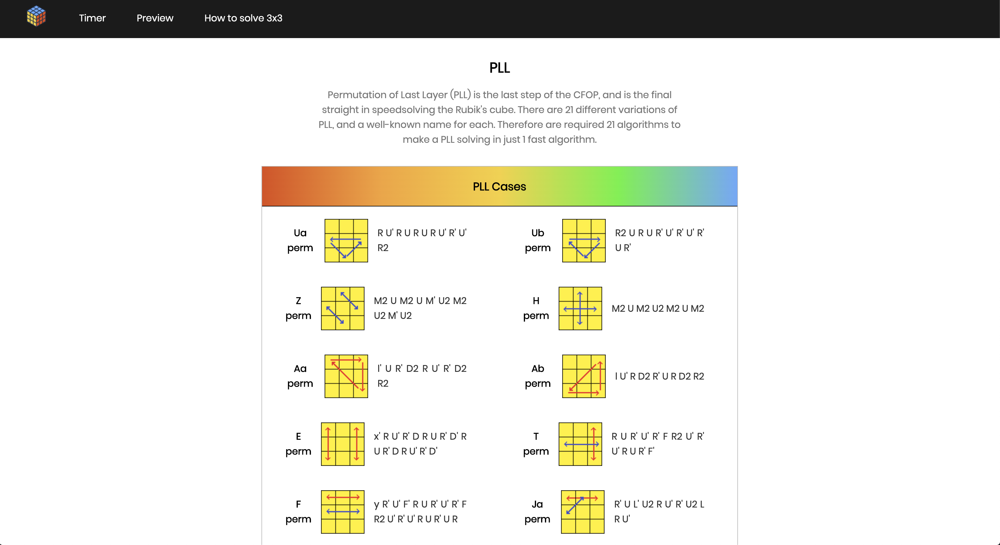

# Rubik's cube
Project for the school subject Web Design in 11 grade in ELSYS.

## [Link](https://ogi02.github.io/Rubiks-cube/build/index.html)

This is a link to the main page of the project. The website is hosted in Github Pages.

### Description

This is a website dedicated to the Rubik's cube. On the main page there is brief history about the Rubik's cube and a little bit of information about my abilities to solve it.

### Pages

Timer page consists of a Rubik's cube timer with a tutorial on how to use it. Every solver can track their times, including their best and average times. Keep in mind that all times are lost, once you leave the page.

Preview page includes all HTML elements without any styling.

> If it wasn't for the requirements, this page would have never existed. :-)

How to solve section includes step-by-step tutorial on the two most used speedsolving methods - CFOP and Roux. Those tutorials most helpful to the once, who already know how to solve the Rubik's cube, but want to get into speedcubing. 

### Screenshots

Main Page

Timer

PLL algorithm set

### Technologies

[Gulp](https://gulpjs.com/) as a setup tool \
HTML + CSS \
Javascript \

### Author

[Ognian Baruh](https://github.com/ogi02)
